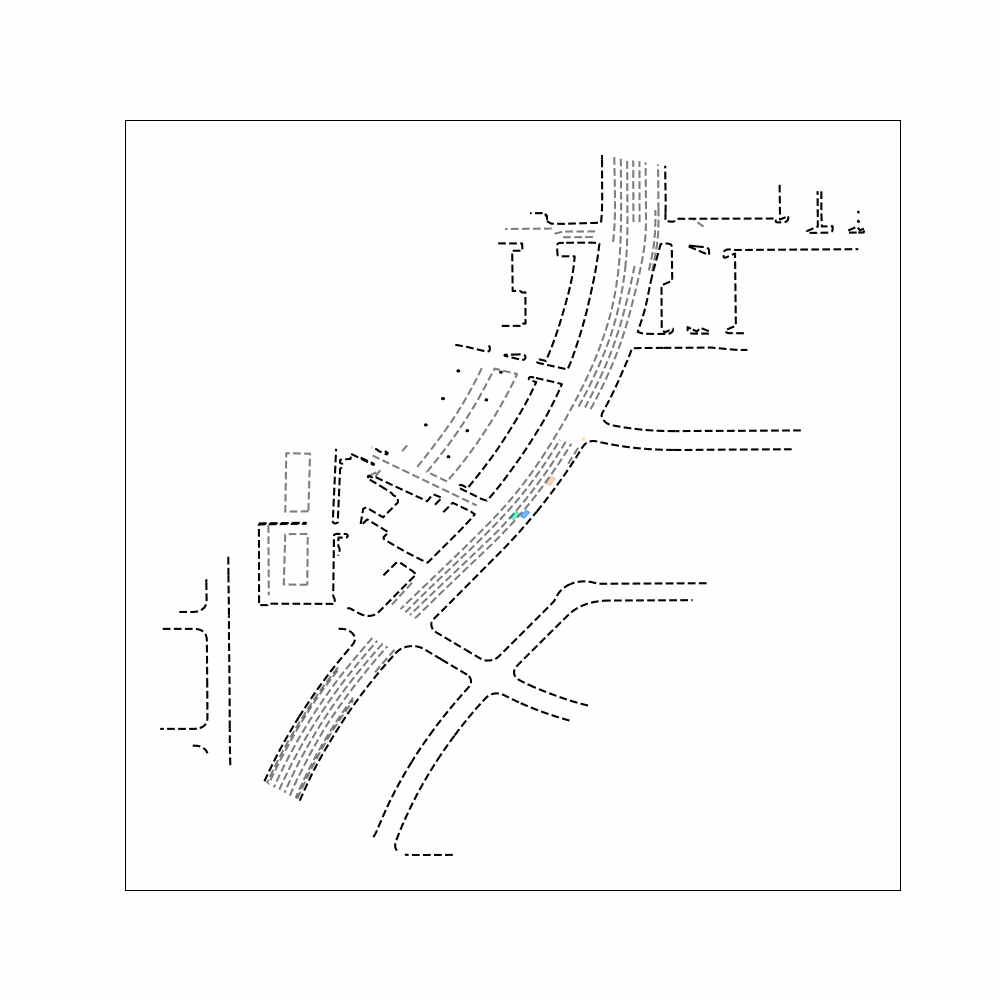
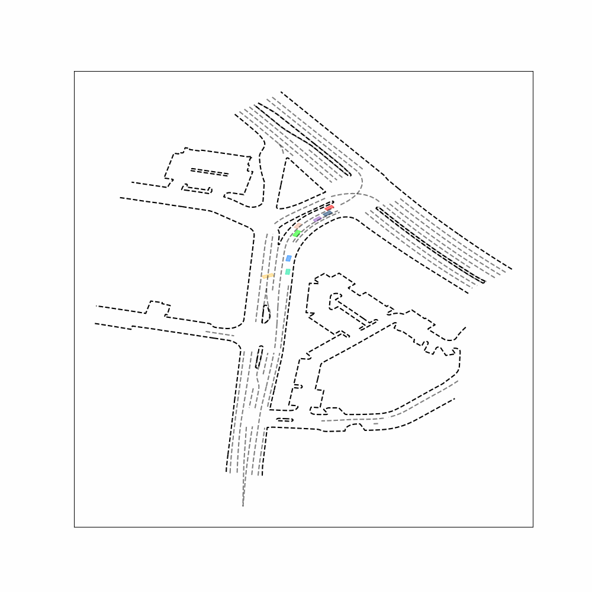

# WcDT: World-centric Diffusion Transformer Traffic Scene Generation

This repository contains the official implementation of WcDT: World-centric Diffusion Transformer for Traffic Scene Generation [[Paper Link](https://arxiv.org/abs/2404.02082)]

## Gettting Started

First of all, we recommend that you read the description of the [Sim Agents Challenge](https://waymo.com/open/challenges/2024/sim-agents/) and the [Motion Prediction](https://waymo.com/open/data/motion/) dataset on the waymo website.

1. Clone this repository:

    git clone https://github.com/yangchen1997/WcDT.git

2. Install the dependencies:

    conda env create -f environment.yml

3. Download [Waymo Open Dataset](https://console.cloud.google.com/storage/browser/waymo_open_dataset_motion_v_1_2_0?pli=1)(Please note: If you are downloading waymo datasets for the first time, you need to click "Download" on the waymo website and register your account).After downloading the dataset directory should be organized as follows:

    /path/to/dataset_root/
    ├── train_set/
      ├── training.tfrecord-00000-of-01000
      ├── training.tfrecord-00001-of-01000
      ├── ...
    └── val_set/
      ├── validation.tfrecord-00000-of-00150
      ├── validation.tfrecord-00001-of-00150
      ├── ...
    └── test_set/
      ├── testing.tfrecord-00000-of-00150
      ├── testing.tfrecord-00001-of-00150
      ├── ...
    

## Tasks

This project includes the following tasks:

1.  Data Preprocess: This task is divided into two subtasks, data compression (which removes redundancy from the waymo dataset) and data splitting.
    
2.  Training
    
3.  Evaluating Models and Visualising Results
    

Before running the project, you need to configure the tasks to be performed in config.yaml.

tasks config:

    task_config:
      task_list:
        - "DATA_PREPROCESS"
        - "DATA_SPLIT"
        - "DATA_COUNT"
        - "TRAIN_MODEL"
        - "SHOW_RESULTS"
        - "EVAL_MODEL"
        - "GENE_SUBMISSION"
      output_dir: "output"
      log_dir: "log"
      image_dir: "result_image"
      model_dir: "model"
      result_dir: "result"
      pre_train_model: ""
      waymo_train_dir: "path to waymo train_set"
      waymo_val_dir: "path to waymo valid_set"
      waymo_test_dir: "path to waymo test_set"
      data_output: "data_output"
      data_preprocess_dir: "data_preprocess_dir"
      train_dir: "train_dir"
      val_dir: "val_dir"
      test_dir: "test_dir"

start tasks:

    bash run_main.sh

### Data Preprocess

task config:

    data_preprocess_config:
      data_size: 100
      max_data_size: 2000
      num_works: 20

### Training

task config:

    train_model_config:
      use_gpu: False
      gpu_ids:
        - 6
        - 7
      batch_size: 4
      num_works: 0
      his_step: 11
      max_pred_num: 8
      max_other_num: 6
      max_traffic_light: 8
      max_lane_num: 32
      max_point_num: 128
      num_head: 8
      attention_dim: 128
      multimodal: 10
      time_steps: 50
      # cosine or linear
      schedule: "linear"
      num_epoch: 200
      init_lr: 0.0001

### Evaluate

|  Model  |  ADE↓  |  MinADE↓  |
| --- | --- | --- |
|  WcDT-64  |  4.872   |  1.962  |
|  WcDT-128  |  4.563  |  1.669  |

### Qualitative Results

Demos for lane-changing scenarios:
<table>
<tr>
  <td>
    <p align="center">
      
      <br>
      <em>Ground truth</em>
    </p>
  </td>
  <td>
    <p align="center">
      
      <br>
      <em>WcDT-128 result</em>
    </p>
  </td>
</tr>
</table>


Demos for more complex turning scenarios:
<table>
<tr>
  <td>
    <p align="center">
      
      <br>
      <em>Ground truth</em>
    </p>
  </td>
  <td>
    <p align="center">
      
      <br>
      <em>WcDT-128 result</em>
    </p>
  </td>
</tr>
</table>

## Todo List

- [x] Data Statistics
- [x] Generate Submission
- [ ] Factorized Attention for  Temporal Features
- [ ] Graph Attention Mechanisms for Transformer
- [ ] Lane Loss(FDE Loss + Timestep Weighted Loss)
- [ ] Scene Label
- [ ] Upgrade Decoder(Prposed + Refined Trajectory)

## Citation

If you found this repository useful, please consider citing our paper:

```bibtex
@article{yang2024wcdt,
  title={Wcdt: World-centric diffusion transformer for traffic scene generation},
  author={Yang, Chen and He, Yangfan and Tian, Aaron Xuxiang and Chen, Dong and Wang, Jianhui and Shi, Tianyu and Heydarian, Arsalan and Liu, Pei},
  journal={arXiv preprint arXiv:2404.02082},
  year={2024}
}
```


